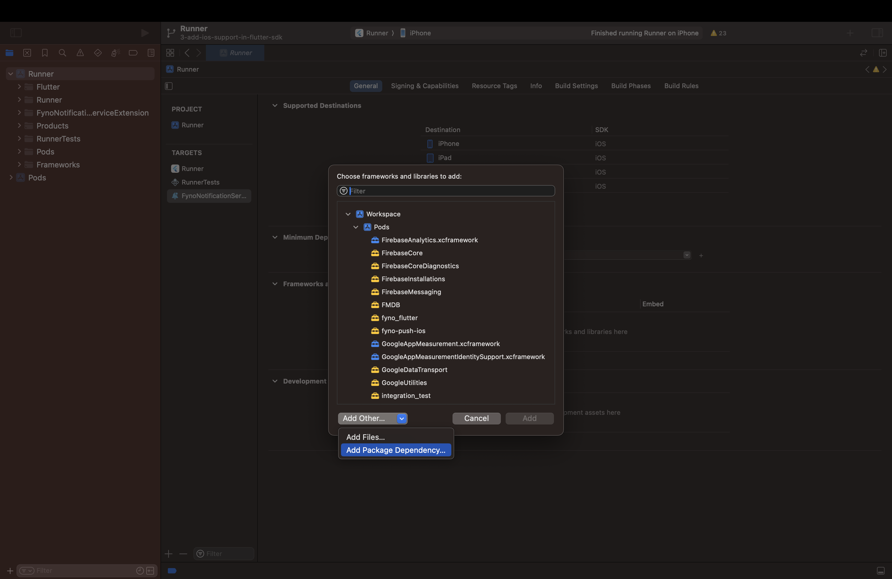

# Fyno React Native Push SDK

Fyno's React Native Push Notification SDK offers a comprehensive set of notification features within your app. It's designed to efficiently deliver messages, ensuring optimal performance and user experience.

## Prerequisites

In order to get started, there are a few prerequisites that needs to be in place:

1. **Fyno account:** A valid Fyno workspace with at least one active API Key. For more info, refer [Workspace Docs](https://docs.fyno.io/docs/workspace-settings).
2. **Configuration:** Configure your Fyno Push provider in [Fyno App](https://app.fyno.io/integrations).
3. **React Native application:** A working React Native application in which you want to integrate the SDK.
4. **iOS specific prerequisites:**
   1. **Apple developer account:** Required details are mentioned in [APNs Docs](https://docs.fyno.io/docs/push-apns).
5. **Android specific prerequisites:**
   1. **Xiaomi Setup:** Setup _Xiaomi Developer Account_ and create application in Xiaomi push console. You may refer to the [Mi Push Documentation](https://docs.fyno.io/docs/push-mi-push) for more details.
6. **FCM prerequisites:**
   1. **Firebase Setup:** Setup Firebase and create application in Firebase Console. You can refer to the [FCM Documentation](https://docs.fyno.io/docs/push-fcm) for more details.
   2. **Google Services File**Download the google-services.json(for Android) or GoogleService-Info.plist(for iOS) from Firebase console and place it in the root folder of the application as per [FCM Documentation for Android](https://firebase.google.com/docs/android/setup) or [FCM Documentation for iOS](https://firebase.google.com/docs/ios/setup).

## Installation

To integrate the Fyno React Native Push SDK into your application, follow these steps:

1. Install the library using npm:

   ```bash
   npm install @fyno/react-native
   ```

2. Import the SDK in your JavaScript file:

   ```javascript
   import FynoReactNative from "@fyno/react-native";
   ```

## Initialising the SDK (should be called on app launch)

- Workspace ID(Mandatory) - Fyno's unique workspace ID, which you will see at the top of the **Workspace Settings** page.
- Integration ID(Mandatory) - The ID of the integration created in [Fyno Integrations](https://app.fyno.io/integrations).
- Distinct ID(Optional) - Unique identifier for your user (An [uuid](https://en.wikipedia.org/wiki/Universally_unique_identifier) is automatically generated if no value is passed).
- Version(Optional) - Indicates the environment in which the user has to be created. Could be either **test** or **live**. (Default value is "live").

```javascript
FynoReactNative.initialise(workspaceId, integrationID, userId, version);
```

## Identifying the User (should be called when you want to update previously created distinct ID or user name)

- Distinct ID(Mandatory) - The distinct ID you want to identify the user with.
- User Name(Optional) - The name you want to assign to the user.

```javascript
FynoReactNative.identifyUser(distinctId, userName);
```

## Registering Push Notifications with APNs or Google FCM

- provider(Mandatory) - Use **apns** if [APNs](https://docs.fyno.io/docs/push-apns) is configured or **fcm** if [Google FCM](https://docs.fyno.io/docs/push-fcm) is configured in the integration.

```javascript
FynoReactNative.registerPush("", "", "", provider);
```

## Registering Push Notifications with Xiaomi Services (Only Android)

- Xiaomi Application Id and Xiaomi Application Key are mandatory fields which can be found under the application registered at [Xiaomi Admin](https://admin.xmpush.xiaomi.com/)
- Push Region(Mandatory) - Refers to the geographical region where push notifications are delivered.
- provider(Mandatory) - Use **xiaomi**.

```javascript
FynoReactNative.registerPush(
  xiaomiApplicationID,
  xiaomiApplicationKey,
  pushRegion,
  provider
);
```

## Merging User Profiles

- Old Distinct ID(Mandatory).
- New Distinct ID(Mandatory).

```javascript
FynoReactNative.mergeProfile(oldDistinctID, newDistinctID);
```

## Updating Message Status

- Callback URL(Mandatory) - You can get the Callback URL from the notification additional payload if the notification was triggered from Fyno.
- Status(Mandatory) - The status of the notification (one of **RECEIVED**, **CLICKED** or **DISMISSED**).

```javascript
FynoReactNative.updateStatus(callbackUrl, status);
```

## Resetting User Information

```javascript
FynoReactNative.resetUser();
```

> 🚧 There are a few more configuration steps in order to enable iOS devices to receive push notifications.

## Getting your application ready

### Step 1: Add capabilities in iOS application

1. Inside Targets select signing and capabilities.
2. Click on +capabilities and add Push Notifications and Background Modes capabilities to your application.


3. In Background Modes, select Remote Notifications option. We use background notifications to receive delivery reports when your app is in quit and background state. Refer [doc](https://developer.apple.com/documentation/usernotifications/setting_up_a_remote_notification_server/pushing_background_updates_to_your_app) to know more about background notifications.


### Step 2: Register for push notification in AppDelegate.mm file

1. Add the below code in your **AppDelegate.mm** file.

> 🚧 Add the FCM integration code if you want to use FCM in iOS (we recommend to register with APNs)

```Text AppDelegate.mm
// without FCM

#import "AppDelegate.h"

#import <React/RCTBundleURLProvider.h>

#import <UserNotifications/UserNotifications.h>
#import <FirebaseMessaging/FirebaseMessaging.h>
#import <FirebaseCore/FirebaseCore.h>
#import <fyno/fyno-Swift.h>

@interface AppDelegate () <UNUserNotificationCenterDelegate>
@property (nonatomic, strong) fyno *fynosdk;
@end

@implementation AppDelegate

- (BOOL)application:(UIApplication *)application didFinishLaunchingWithOptions:(NSDictionary *)launchOptions
{
  self.moduleName = @"ReactNativePushTest";
  // You can add your custom initial props in the dictionary below.
  // They will be passed down to the ViewController used by React Native.
  self.initialProps = @{};

  UNUserNotificationCenter.currentNotificationCenter.delegate = self.fynosdk;
  self.fynosdk = [fyno app];

  [self.fynosdk registerForRemoteNotifications];

  return [super application:application didFinishLaunchingWithOptions:launchOptions];
}

- (void)application:(UIApplication *)application didFailToRegisterForRemoteNotificationsWithError:(NSError *)error {
  NSLog(@"Failed to register for remote notifications: %@", error.localizedDescription);
}

- (void)application:(UIApplication *)application didRegisterForRemoteNotificationsWithDeviceToken:(NSData *)deviceToken {
  // Send the device token to fynoServer
  [self.fynosdk setdeviceTokenWithDeviceToken:deviceToken];
}

- (NSURL *)sourceURLForBridge:(RCTBridge *)bridge
{
  return [self getBundleURL];
}

- (NSURL *)getBundleURL
{
#if DEBUG
  return [[RCTBundleURLProvider sharedSettings] jsBundleURLForBundleRoot:@"index"];
#else
  return [[NSBundle mainBundle] URLForResource:@"main" withExtension:@"jsbundle"];
#endif
}

@end
```

```Text AppDelegate.mm
// with FCM

#import "AppDelegate.h"

#import <React/RCTBundleURLProvider.h>

#import <UserNotifications/UserNotifications.h>
#import <FirebaseMessaging/FirebaseMessaging.h>
#import <FirebaseCore/FirebaseCore.h>
#import <fyno/fyno-Swift.h>

@interface AppDelegate () <UNUserNotificationCenterDelegate>
@property (nonatomic, strong) fyno *fynosdk;
@end

@implementation AppDelegate

- (BOOL)application:(UIApplication *)application didFinishLaunchingWithOptions:(NSDictionary *)launchOptions
{
  self.moduleName = @"ReactNativePushTest";
  // You can add your custom initial props in the dictionary below.
  // They will be passed down to the ViewController used by React Native.
  self.initialProps = @{};

  UNUserNotificationCenter.currentNotificationCenter.delegate = self.fynosdk;
  self.fynosdk = [fyno app];

  [self.fynosdk registerForRemoteNotifications];

  [FIRApp configure]; // add only if FCM has been integrated

  return [super application:application didFinishLaunchingWithOptions:launchOptions];
}

- (void)application:(UIApplication *)application didFailToRegisterForRemoteNotificationsWithError:(NSError *)error {
  NSLog(@"Failed to register for remote notifications: %@", error.localizedDescription);
}

- (void)application:(UIApplication *)application didRegisterForRemoteNotificationsWithDeviceToken:(NSData *)deviceToken {
  // Send the device token to fynoServer
  [self.fynosdk setdeviceTokenWithDeviceToken:deviceToken];

  [FIRMessaging messaging].APNSToken = deviceToken; // add only if FCM has been integrated
}

- (NSURL *)sourceURLForBridge:(RCTBridge *)bridge
{
  return [self getBundleURL];
}

- (NSURL *)getBundleURL
{
#if DEBUG
  return [[RCTBundleURLProvider sharedSettings] jsBundleURLForBundleRoot:@"index"];
#else
  return [[NSBundle mainBundle] URLForResource:@"main" withExtension:@"jsbundle"];
#endif
}

@end
```

## Add Notification Service Extension to your application

1. In Xcode go to **File** > **New** > **Target**.
2. Select `Notification Service Extension` from the template list.
3. Then in Next popup give it any product name, select your team, select Objective-C language and click finish.


4. After clicking on "Finish", a folder will be created with your given product name. Replace the contents of the **NotificationService.m** file with the below code.

```Text NotificationService.m
#import "NotificationService.h"
#import <fyno/fyno-Swift.h>
#import <FirebaseCore/FirebaseCore.h>
#import <FirebaseMessaging/FirebaseMessaging.h>

@interface NotificationService ()

@property (nonatomic, strong) void (^contentHandler)(UNNotificationContent *contentToDeliver);
@property (nonatomic, strong) UNMutableNotificationContent *bestAttemptContent;

@end

@implementation NotificationService

- (void)didReceiveNotificationRequest:(UNNotificationRequest *)request withContentHandler:(void (^)(UNNotificationContent * _Nonnull))contentHandler {
  [[fyno app] handleDidReceive:request withContentHandler:contentHandler];
}

- (void)serviceExtensionTimeWillExpire {
    // Called just before the extension will be terminated by the system.
    // Use this as an opportunity to deliver your "best attempt" at modified content, otherwise the original push payload will be used.
    self.contentHandler(self.bestAttemptContent);
}

@end

```

5. In order for the **Notification Service Extension** to be able to access fyno and the Firebase SDKs, you will have to import it by following the below steps:


Select the framework named **fyno.xcframework** and click on Add




Search for `https://github.com/firebase/firebase-ios-sdk` in the text box. Select and add the package named **firebase-ios-sdk**.


Scroll down to find FirebaseMessaging and add it to the Notification Service Extension you had created.

> 🚧 If you face any build issues similar to `Error (Xcode): Cycle inside Runner; building could produce unreliable results` after adding the notification service extension, follow [this](https://stackoverflow.com/a/77261331) answer to resolve it.

> 👍 You have successfully configured the React Native SDK for receiving push notifications.

## License

This project is licensed under the MIT License. See the [LICENSE](LICENSE) file for details.
